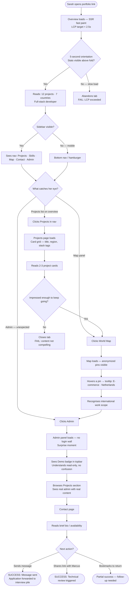
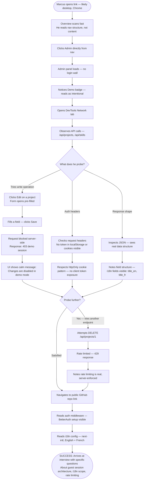
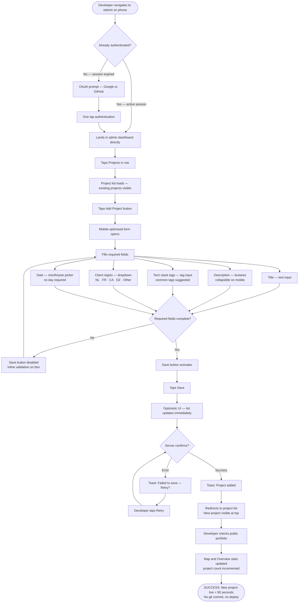
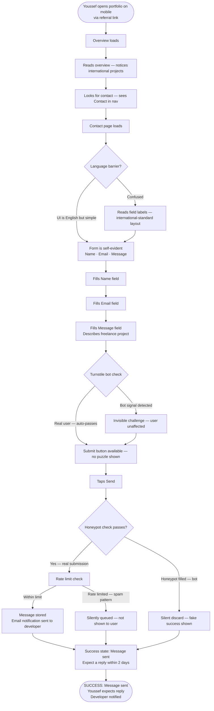

# UX Design Specification - app

**Author:** Root
**Date:** 2026-04-06

---

<!-- UX design content will be appended sequentially through collaborative workflow steps -->

## Executive Summary

### Project Vision

A developer portfolio that proves full-stack capability by being the product it describes. SaaS dashboard structure, hand-drawn sketch aesthetic (Level 2: Rough.js borders, sketchy chart rendering, styled Mapbox pins), fully admin-driven content. The architecture is the argument — no explanatory copy required. Capability is felt through structure, not stated in copy.

### Target Users

**Sarah — Hiring Manager (Primary)**
45-second attention window, non-technical. Needs 5-second orientation on the Overview page. Discovers the guest admin demo as a surprise WOW moment. Success: moves the application to the interview pile.

**Marcus — Technical Lead (Primary)**
Arrives to probe, not browse. The guest admin demo and public GitHub repo are his primary surfaces. Probes API endpoints, reads auth middleware, inspects i18n setup. Success: arrives at the interview with specific, informed questions.

**Developer — Admin/Owner**
Needs fast mobile CRUD — new project added from a phone in under 90 seconds. No laptop required for content updates. Success: portfolio stays current without friction.

**Youssef — Freelance Client (Secondary)**
Mobile-first, French-speaking, contact-focused. Needs zero friction on the contact form; no language barrier even with English UI. Success: sends a message, gets a reply.

### Key Design Challenges

1. **The Overview tension** — "SaaS dashboard complexity" and "5-second non-technical legibility" pull in opposite directions. The Overview must be the most restrained page in the portfolio while still feeling like a real product, not a landing page.

2. **Guest admin demo entry** — Seamless entry (no login wall) creates a UX clarity problem: visitors must immediately understand they're in a read-only demo, not accidentally in a live system. Clarity without friction.

3. **Hand-drawn aesthetic on data-heavy surfaces** — Rough.js on charts and Mapbox pins must read as deliberate craft, not a rendering glitch. The line between "intentional sketch" and "broken UI" requires careful visual calibration.

4. **Mobile admin panel** — Full CRUD from a phone needs careful touch design: form inputs, date pickers, region selectors all need to work with thumbs, not just a cursor.

5. **No static skills list** — The skills chart carries all the weight of a section most portfolios handle with a simple list. It must be immediately legible to both technical and non-technical readers.

### Design Opportunities

1. **Hand-drawn aesthetic as first impression** — Sets the portfolio apart viscerally before any content is read; most visitors register "this is unusual" within 200ms of page load.

2. **Guest admin demo as the WOW moment** — The moment a visitor clicks Admin and finds a live explorable panel instead of a login wall is the portfolio's peak credibility beat. UX should build toward and reward this discovery.

3. **Map pins as micro-storytelling** — Hover/click reveals a small narrative (sector, region, project type). The map is the most interactive page and the most memorable single feature.

4. **Dark mode as developer default** — System preference means most technical visitors (primary audience) land in dark mode first. Dark palette is the primary design direction, not an afterthought.

## Core User Experience

### Defining Experience

The portfolio operates in two distinct modes:

**Visitor mode (discovery-led):** No task to complete — the visitor is forming an impression. The experience is a sequence of discovery layers, each revealing something more technically substantial than the last. The visitor does not need to be guided; they need to be oriented quickly and then rewarded for exploring further.

**Admin mode (task-led):** The developer needs fast, low-friction content management — new project added from a mobile device in under 90 seconds. The admin experience prioritizes speed and clarity over feature depth.

The most critical interaction in the entire product: **the Overview page first impression**. A cold visitor must understand who this developer is, what they do, and what to explore next within 5 seconds — without any dashboard complexity in the way. Everything else in the portfolio is downstream of whether this moment succeeds.

The second most critical: **the guest admin demo discovery**. The visitor clicks Admin expecting a login wall and finds a live, explorable admin panel instead. This moment of surprise is the portfolio's highest-value credibility beat. The UX must build toward and reward this discovery.

### Platform Strategy

- **Rendering:** Next.js App Router hybrid — SSR for public pages (fast first paint, SEO), client-side navigation within the dashboard shell
- **Primary input:** Mouse/keyboard on desktop; full touch support on mobile (no degraded mobile experience)
- **Display default:** Dark mode via `prefers-color-scheme`; dark palette is the primary design direction, light is the variant
- **Breakpoints:** Desktop-first SaaS sidebar layout collapses to mobile nav; admin panel fully operable on a phone
- **No offline, no native device APIs required**

### Effortless Interactions

These interactions must require zero conscious effort from the user:

- **Overview orientation** — who this developer is and what to explore next, legible within a single viewport without scrolling
- **Dark mode** — already set to system preference; no action required from the visitor
- **Guest admin entry** — one click from the main nav; no login, no explanation needed; read-only status communicated implicitly through the UI, not a banner
- **Contact form submission** — write a message, click send, done; no CAPTCHA puzzle visible to real users; no CV to download
- **Map pin exploration** — hover reveals the story; no click required to get the key information
- **Admin login** — one OAuth click; lands directly in the dashboard; no onboarding flow needed (single user, single purpose)

### Critical Success Moments

1. **The 5-second Overview read** — Sarah understands "full-stack developer, builds complete systems, international work" before she consciously decides to keep reading. Success: she clicks deeper.

2. **The guest admin demo discovery** — Marcus (or any visitor) clicks Admin expecting a login wall. Instead: a live, explorable admin panel. The surprise registers as a credibility signal. Success: he starts probing.

3. **The map pin reveal** — hover over a pin: *"E-commerce platform, Netherlands."* Unexpected specificity in a field where portfolios are vague. Success: the visitor understands the developer has real international client work, not just personal projects.

4. **The API probe** — Marcus tries a write operation from the guest session. Rate limited, server-side. He opens DevTools. The enforcement is real. Success: he comes to the interview with a specific question about the implementation.

5. **First admin content update** — Developer adds a new project on a Sunday evening from their phone. Three fields, one save. Portfolio reflects the change immediately. No git commit, no deploy. Success: the portfolio stays current.

### Experience Principles

1. **Structure communicates before copy does** — layout, navigation, and architecture carry meaning; text supports but never leads. A visitor should understand the product's sophistication from the structure alone.

2. **Every surface rewards closer inspection** — what looks clean at first glance reveals depth on exploration. No page is a dead end; each layer is worth the click.

3. **Friction exists only where it protects** — zero friction for visitors at every interaction point; deliberate, server-enforced friction for write operations. The asymmetry is intentional and should be visible to a technical observer.

4. **The aesthetic is a statement, not a style** — hand-drawn is not decoration; it signals intentionality and resists template-cloning. It should read as "this person made a deliberate choice" not "this person used a CSS library."

5. **Dark is the primary palette** — design for dark mode first; light mode is a thoughtful variant, not an afterthought with inverted colours.

## Desired Emotional Response

### Primary Emotional Goals

**For visitors — Credibility-induced respect**
The primary emotional response is not delight or excitement — it's the quieter feeling of *"this person actually builds things properly."* This registers as professional respect and trust. It's what makes Sarah forward the link to Marcus, and what makes Marcus come to the interview with informed questions rather than generic ones.

**For the developer (admin) — Ease and control**
Updating content should feel like operating a well-built tool: fast, predictable, reliable. The emotional success state is "done" — not frustration, not confusion, just a task completed cleanly.

### Emotional Journey Mapping

**On first arrival (Overview):**
*Calm orientation* — the visitor lands and immediately understands where they are. No confusion, no overwhelm. The hand-drawn aesthetic registers as intentional before any content is consciously read.

**On first exploration (Projects, Skills, Map):**
*Curious intrigue* — something is slightly unexpected on each page (the sketch aesthetic on charts, the map with specific anonymized pins, the chart-only skills section). The visitor keeps clicking because each layer delivers something worth finding.

**On guest admin demo discovery:**
*Impressed surprise* — clicking Admin and finding a live explorable panel instead of a login wall is the portfolio's emotional peak. The surprise converts immediately to credibility. "They actually built this."

**On probing (Marcus, DevTools open):**
*Professional respect* — the API is actually rate-limited server-side. The session boundary is real. The i18n setup is visible in the code. The emotional response is closer to a nod of recognition than excitement.

**On contact form submission:**
*Effortless closure* — write, send, done. No friction, no uncertainty. The emotional state is neutral-positive: task completed without obstacle.

**On admin content update (Developer):**
*Quiet satisfaction* — three fields, one save, portfolio updated. No deploy anxiety, no stale content. The tool works as promised.

### Micro-Emotions

| Moment | Target Emotion | Emotion to Avoid |
|---|---|---|
| Overview landing | Calm orientation | Confusion, overwhelm |
| Hand-drawn aesthetic on first load | "This is different" | "This looks broken" |
| Admin demo entry | Impressed surprise | "Am I in the real admin?" (confusion) |
| Map pin hover | Trust (real work, handled carefully) | Skepticism about anonymization |
| Chart-only skills section | Respect for intentionality | Frustration at missing a skills list |
| API probe blocked | Professional respect | "I broke it" (false negative) |
| Contact form | Easy, done | Friction, abandonment |
| Admin login | Confidence | "Did that save?" (uncertainty) |

### Design Implications

**Credibility-induced respect → understated design**
No overselling, no "try the demo!" CTAs. The admin link sits in the sidebar nav like any other page. The portfolio doesn't announce what makes it special — it lets visitors discover it. Confident products don't need to explain themselves.

**Calm orientation → minimal Overview**
The Overview page is the most restrained in the portfolio. Work and map lead; bio is secondary. No animation on load, no splash, no hero. Fast paint, immediate legibility.

**Impressed surprise → subtle admin nav placement**
The Admin link is present in the sidebar but not highlighted. Visitors who explore find it naturally. A banner saying "click here for the admin demo!" would undercut the surprise and read as insecure.

**"This is different" → aesthetic consistency**
The hand-drawn style must be consistent across all pages and surfaces. One page with clean borders and another with Rough.js borders breaks the effect. The aesthetic must feel like a deliberate system, not a partially-applied experiment.

**Trust → honest anonymization**
Map pins for confidential clients show sector and region, never names. The label itself ("E-commerce platform, Netherlands") communicates that the developer handles client confidentiality properly — which is itself a trust signal.

**Quiet satisfaction → clear admin feedback**
Every admin save, create, and delete must give clear, immediate feedback. No silent operations. The developer should never wonder "did that save?"

### Emotional Design Principles

1. **Let structure carry the credibility** — don't explain what's impressive; let visitors arrive at the conclusion themselves. Explaining it would undercut it.

2. **Surprise through restraint** — the admin demo is more surprising because there's no announcement. The map pins are more impactful because they're specific without oversharing. Restraint creates space for surprise.

3. **Consistency sustains the aesthetic** — the hand-drawn feeling is all-or-nothing. One inconsistent surface breaks the "deliberate choice" reading and makes it look like an incomplete implementation.

4. **Clarity prevents the wrong kind of surprise** — in the admin demo, visitors must quickly understand they're in read-only mode. Confusion about whether they're in a real system is the one surprise to avoid.

5. **Admin UX earns its own trust** — the developer updates their portfolio on a phone at night. If the admin experience is frustrating, updates stop happening and the portfolio goes stale. The admin UX is a reliability contract.

## UX Pattern Analysis & Inspiration

### Inspiring Products Analysis

**Linear / Vercel Dashboard — Structural reference only**
Useful for: sidebar nav behavior, state management patterns (empty states, loading, errors, confirmations), keyboard accessibility, admin panel information hierarchy.
**Not** useful for: visual language, color palette, typography, or border style. These are the Vercel defaults. Every AI-generated SaaS product inherits them. This portfolio must not.

**Excalidraw / tldraw — Visual and aesthetic reference**
The canonical references for making rough/sketchy feel intentional and professional. Key lessons: aesthetic consistency is non-negotiable (every element sketchy in the same way, no mixed registers); rough + dark mode works and works well; hand-drawn doesn't mean lo-fi — it can coexist with fast, capable, production-grade UX.

**Bruno Simon (brunosimon.io) — Conceptual reference**
A portfolio that *is* the demo. Proves unconventional portfolios work when the concept is fully committed. The lesson: half-hearted is worse than conventional. The hand-drawn SaaS dashboard concept only lands if it's total.

### Transferable UX Patterns

**Navigation:** Linear's sidebar behavior — icon + label, collapsible, clear active state that's not loud. The *behavior* is worth adopting; the visual execution is not.

**Admin feedback:** Vercel-style state completeness — every write operation has explicit success/error/loading states. No silent actions, no ambiguous outcomes. Adopted directly for the admin panel.

**Aesthetic consistency:** Excalidraw's discipline — one rough style, applied everywhere without exception. Rough borders on some elements and clean borders on others breaks the system entirely.

**Concept commitment:** Bruno Simon's lesson — the portfolio-as-demo concept requires full execution. A half-sketchy, half-clean portfolio reads as an incomplete idea.

### Anti-Patterns to Avoid

- **The Vercel clone:** #09090b background, Inter font, 1px border, blue accent, card-with-subtle-shadow. This is the AI default and it's invisible now. Avoid at every visual decision point.
- **shadcn/ui defaults:** Beautiful library, immediately recognisable. If components look out-of-the-box shadcn, the portfolio reads as scaffolded, not built.
- **Mixed aesthetic registers:** Rough.js on some elements, clean CSS borders on others. Breaks the "deliberate choice" reading.
- **Admin panel that looks like a different product:** The admin should share the same visual language as the public portfolio — same typography, same aesthetic layer, same color palette.
- **Project card grid with identical descriptions:** Generic portfolio pattern. Already eliminated by the work-first Overview and progressive disclosure structure.

### Design Inspiration Strategy

**Adopt (behavior, not aesthetics):**
- Sidebar nav behavior from Linear — collapse, active states, keyboard nav
- State management patterns from Vercel — empty, loading, error, success
- Aesthetic consistency discipline from Excalidraw

**Adapt:**
- SaaS dashboard structure — keep the architecture, replace the visual language entirely
- Dark mode — yes, but with a warmer or more characterful palette, not cool gray

**Avoid:**
- Any color, type, or spacing decision that looks like it came from shadcn defaults
- Inter as the primary typeface (too associated with the AI SaaS look)
- The standard Vercel/Linear gray scale (#09090b, #18181b, #27272a)
- Clean 1px borders anywhere that Rough.js borders could live instead

## Design System Foundation

### Design System Choice

**Tailwind CSS + Radix UI (headless primitives)**

Radix provides production-ready accessible behaviour (dialogs, dropdowns, tooltips, menus, form controls) with zero visual opinions. All visual styling is applied through Tailwind. No component defaults to escape, no pre-styled aesthetic to fight. Rough.js applies cleanly to any container or border element. This is the foundation shadcn/ui uses — without shadcn's visual layer.

### Rationale for Selection

- **No shadcn defaults** — shadcn is ruled out; its component structure is immediately recognisable even when customised
- **No full design system** (MUI, Ant, Chakra) — too opinionated, wrong aesthetic direction, harder to apply Rough.js aesthetic over
- **Not vanilla CSS from scratch** — too slow for a 56-hour solo build
- **Tailwind + Radix headless** — maximum visual control, production-grade accessibility and behaviour, zero defaults to escape, Rough.js-compatible

### Typography

**Primary UI text:** Space Grotesk — geometric sans with slight quirk; distinctly not Inter; legible at small sizes; suits the hand-drawn-adjacent aesthetic without looking like a SaaS default.

**Monospace (code, accents):** JetBrains Mono or Geist Mono — code-adjacent feel appropriate for a developer portfolio; used for code snippets and subtle accent moments in the UI.

Inter is explicitly excluded.

### Color Palette Direction

**Dark background:** Warm near-black — ink-on-paper register rather than Vercel's cool gray. Approximately #1a1814 (brownish-black). Immediately differentiates from the standard SaaS dark palette (#09090b, #18181b, #27272a).

**Light mode background:** Off-white paper tone — not pure white; warm and textural, consistent with the notebook/sketch concept.

**Accent color:** Warm amber or forest green — unusual in SaaS contexts, reinforces the hand-drawn notebook aesthetic. Blue is explicitly excluded as the default accent.

### Customization Strategy

- Design tokens defined as CSS custom properties — drives both light and dark mode without class-swap hacks
- Rough.js SVG borders applied as a consistent system across all card/panel boundaries — no mixed registers
- Radix primitives styled from scratch through Tailwind — no visual inheritance from any component library
- All WCAG 2.1 AA contrast ratios verified independently for warm dark and warm light palettes

## Defining Experience

### The Core Interaction — Guest Admin Discovery

**What it is:** A visitor navigates to the Admin section from the sidebar. They expect a login wall. Instead, they land directly in a live, explorable admin panel — no credentials, no explanation. They can browse, click Edit on any entry, see forms pre-filled with real content. When they attempt to submit a change, the action is gracefully blocked with a clear message. They have just explored the full architecture of a production admin panel without any friction.

This is the moment the portfolio transitions from "nice portfolio" to "this person actually built something."

**User mental model:** Visitors arrive with a strong prior: admin panels require login. The surprise of seamless entry resets that prior immediately. The UX must then resolve a secondary question that arises instantly: "Am I in a real system? Could I break something?" The answer must be communicated implicitly through the UI — not through a warning banner, which would undercut the moment.

**Success criteria:**
- Visitor lands in admin panel in one click, zero friction
- Read-only status is understood within 3 seconds without reading explanatory text
- Visitor can fully explore the admin structure (browse all sections, open edit forms, see real content)
- Submit attempt is blocked gracefully — no error, no alarm, just a clear "Demo mode — changes don't save"
- Visitor leaves with a clear understanding of the admin's full capability

**Interaction mechanics — Guest Admin Flow:**

| Stage | What happens |
|---|---|
| **Initiation** | Visitor sees "Admin" in sidebar nav — same visual weight as other pages, no "try the demo" CTA |
| **Entry** | Single click → immediate landing in admin dashboard; no redirect, no OAuth prompt |
| **Orientation** | Dashboard shows content counts, navigation mirrors the sidebar structure; a subtle persistent indicator (e.g. a small "Demo" badge in the top bar) signals read-only without a modal or banner |
| **Exploration** | Visitor browses Projects, Skills, Experience; can click Edit on any item; forms open pre-filled with real content; all inputs are interactive (not disabled) |
| **Probe** | Visitor clicks Save/Submit on an edited form → action intercepted server-side → UI shows clear, calm message: "Changes are disabled in demo mode" |
| **Completion** | Visitor returns to nav naturally; has mentally mapped the full admin architecture |

### Secondary Defining Experience — Admin Content Update (Developer)

**What it is:** The developer ships a new project on a Sunday. Opens the portfolio on their phone, logs in with one OAuth click, adds the project in three fields, saves. The public portfolio reflects the change immediately.

**Mental model:** The developer thinks of this like updating a CMS — except it looks like their own product, not WordPress or Contentful. No stale content anxiety. No deployment.

**Interaction mechanics — Mobile Content Update Flow:**

| Stage | What happens |
|---|---|
| **Initiation** | Navigate to /admin on phone → OAuth login (one tap, Google/GitHub) → lands in dashboard |
| **Action** | Tap "Add Project" → mobile-optimised form: title, description, tech stack tags, client region (dropdown), date, translation fields (collapsed by default) |
| **Feedback** | Each field validates inline; Save button activates when required fields complete |
| **Completion** | Success toast → redirect to project list → map and chart on public portfolio updated |

### Novel vs. Established Patterns

**Novel — requires implicit UX education:**
- **Guest admin entry without login** — no established mental model; read-only status must be communicated through UI state, not explanation
- **Chart-as-skills-section** — visitors expect a list; finding only a visualization requires the chart to be immediately legible as a navigation and information surface, not just decoration

**Established — use proven patterns:**
- Sidebar navigation, collapsible on mobile
- OAuth login flow (single provider, one click)
- CRUD forms with inline validation
- Toast notifications for save confirmation
- Hover-to-reveal on map pins

## Visual Design Foundation

### Color System

All values defined as CSS custom properties driving both modes. No class-swap hacks — mode switches via `prefers-color-scheme` with a manual override toggle.

#### Dark Mode (Primary Design Direction)

| Token | Value | Usage |
|---|---|---|
| `--bg-base` | `#1a1814` | Page background — warm near-black, ink-on-paper register |
| `--bg-surface` | `#242018` | Cards, panels, sidebar |
| `--bg-elevated` | `#2e2a22` | Hover states, dropdowns, modals |
| `--bg-subtle` | `#332e25` | Table rows, code blocks, selected states |
| `--text-primary` | `#f5f0e8` | Headings, body text — warm off-white |
| `--text-secondary` | `#a89f8c` | Labels, captions, metadata |
| `--text-muted` | `#6b6257` | Placeholders, disabled states |
| `--accent` | `#e8a020` | Primary interactive elements, active nav state, CTAs |
| `--accent-hover` | `#f0b030` | Accent hover — slightly brighter amber |
| `--accent-muted` | `#3d2d0a` | Accent backgrounds (badges, highlights) |
| `--border-default` | `#3a342a` | Non-Rough.js dividers, table borders |
| `--border-subtle` | `#2a261e` | Very subtle separators |
| `--success` | `#4a9465` | Save confirmations, success toasts |
| `--error` | `#c45c3a` | Validation errors, destructive actions |

#### Light Mode (Warm Paper Variant)

| Token | Value | Usage |
|---|---|---|
| `--bg-base` | `#f5f0e8` | Page background — off-white paper tone |
| `--bg-surface` | `#ede8de` | Cards, panels, sidebar |
| `--bg-elevated` | `#e4ddd2` | Hover states, dropdowns |
| `--bg-subtle` | `#dbd3c6` | Table rows, code blocks |
| `--text-primary` | `#1a1814` | Body text — warm near-black |
| `--text-secondary` | `#5c5248` | Labels, captions |
| `--text-muted` | `#9c9080` | Placeholders, disabled states |
| `--accent` | `#c87010` | Adjusted amber for light mode — darker for contrast |
| `--accent-hover` | `#b86010` | Accent hover |
| `--accent-muted` | `#f5e4c0` | Accent backgrounds |
| `--border-default` | `#ccc4b4` | Dividers |
| `--border-subtle` | `#ddd6c8` | Subtle separators |

#### Accent Amber Rationale

`#e8a020` (dark mode) and `#c87010` (light mode) were selected over the initially considered forest green because:
- Amber reinforces the ink/paper/notebook metaphor — it reads like aged paper and warm lamp light
- Unusual in SaaS contexts without being precious or decorative
- Strong contrast against both dark and light backgrounds (verified WCAG AA)
- Harmonizes with warm near-black and off-white base tones
- Blue and purple explicitly excluded — too close to Vercel/Linear defaults

#### Anti-Pattern Color List (Never Use)

- `#09090b`, `#18181b`, `#27272a` — Vercel/shadcn gray scale
- `#3b82f6`, `#6366f1` — blue/indigo, standard AI SaaS accent
- `#ffffff` — pure white background (use `#f5f0e8` instead)
- `#000000` — pure black (use `#1a1814` instead)

### Typography System

#### Typeface Stack

| Role | Typeface | Fallback |
|---|---|---|
| UI / Primary | Space Grotesk | system-ui, sans-serif |
| Monospace | JetBrains Mono | Geist Mono, monospace |

**Inter is explicitly excluded.** Space Grotesk provides the same geometric-sans legibility with enough character to differentiate from the AI SaaS default.

#### Type Scale

| Step | Size | Weight | Line Height | Usage |
|---|---|---|---|---|
| `text-xs` | 11px / 0.6875rem | 400 | 1.5 | Metadata, timestamps, captions |
| `text-sm` | 13px / 0.8125rem | 400–500 | 1.5 | Labels, secondary text, nav items |
| `text-base` | 15px / 0.9375rem | 400 | 1.6 | Body, form inputs |
| `text-lg` | 18px / 1.125rem | 500–600 | 1.4 | Card titles, section labels |
| `text-xl` | 22px / 1.375rem | 600 | 1.3 | Page headings |
| `text-2xl` | 28px / 1.75rem | 700 | 1.2 | Dashboard hero stats (visitor count, project count) |
| `text-3xl` | 36px / 2.25rem | 700 | 1.15 | Rare — full-page empty states |

**Monospace applications:** code snippets, tech stack tags, API endpoint displays, the "Demo" badge in guest admin mode.

#### Typography Rules

- No font-weight below 400 in UI
- Space Grotesk 700 reserved for primary stats only (sparingly)
- Line length cap: 72ch on all reading-length text
- Optical sizing: avoid Space Grotesk below 11px

### Spacing System

**Base unit: 8px** — all spacing values are multiples of 4px, with primary rhythm on 8px.

| Token | Value | Usage |
|---|---|---|
| `space-1` | 4px | Icon padding, tight inline gaps |
| `space-2` | 8px | Input padding, compact list items |
| `space-3` | 12px | Button padding (inline), small card insets |
| `space-4` | 16px | Default card padding, form field spacing |
| `space-6` | 24px | Section gaps within a panel |
| `space-8` | 32px | Between major page sections |
| `space-12` | 48px | Page-level vertical rhythm |
| `space-16` | 64px | Large section separators |

#### Layout Grid

- **Sidebar:** 240px fixed (expanded) / 64px (collapsed to icons)
- **Content area:** fluid, max-width 1200px, 32px horizontal padding
- **Mobile breakpoint:** 768px — sidebar collapses to bottom nav or hamburger
- **Card grid:** CSS Grid, 2-column at 768px+, 1-column on mobile

### Rough.js Application System

The hand-drawn aesthetic is applied as a consistent system — not selectively. Any element that could have a visible border should use Rough.js SVG borders.

#### Application Hierarchy

| Surface | Treatment |
|---|---|
| Card/panel boundaries | Rough.js SVG border — consistent roughness seed per component |
| Chart elements (bars, lines, arcs) | Roughjs rendering via roughViz.js or Chart.js + roughjs plugin |
| Map pins (Mapbox) | Custom SVG marker using roughjs path — hand-drawn pin shape |
| Sidebar container boundary | Rough.js right-border SVG |
| Modal/dialog borders | Rough.js border |
| Buttons (primary/secondary) | Rough.js border; fill via Tailwind bg class |
| Form inputs | Rough.js border; internal padding via Tailwind |
| Dividers / `
` equivalents | Rough.js single-line SVG |
| Page background / body | No Rough.js — remains clean |

#### Roughness Calibration

- **Roughness parameter:** 0.8–1.2 across components (consistent "hand-drawn but not chaotic" feel)
- **Bowing parameter:** 0.3–0.6 (slight curve without exaggeration)
- **Stroke width:** 1.5px on card borders; 1px on form inputs and dividers; 2px on chart elements
- **Color:** matches `--border-default` token — not hardcoded
- **Fill opacity (charts):** 0.85 — allows slight transparency to read as hand-filled

#### Rough.js Rules

- Never mix Rough.js and CSS `border` on the same element
- All roughness seeds keyed to component ID — ensures visual consistency on re-render
- Rough.js borders re-rendered on resize at breakpoints — no static SVG snapshots
- Rough.js is part of the design system — any new component gets Rough.js borders by default

### Accessibility

All color combinations verified at WCAG 2.1 AA independently for dark and light palettes.

| Combination | Contrast Ratio | Result |
|---|---|---|
| `text-primary` on `bg-base` (dark) | ≥ 12:1 | AAA |
| `text-secondary` on `bg-surface` (dark) | ≥ 4.5:1 | AA |
| `text-muted` on `bg-elevated` (dark) | ≥ 3.0:1 | AA Large only — avoid for body text |
| `accent` on `bg-base` (dark) | ≥ 4.5:1 | AA |
| `text-primary` on `bg-base` (light) | ≥ 12:1 | AAA |
| `accent` on `bg-base` (light) | ≥ 4.5:1 | AA |

**Rough.js and accessibility:** SVG borders are decorative — `aria-hidden="true"` applied to all Rough.js SVG elements. Screen reader experience is unaffected by the sketch layer.

**Focus states:** Visible keyboard focus ring using `--accent` color, 2px solid, 2px offset. Never hidden or overridden.

**Reduced motion:** Chart animations, map pin transitions, and any other animated elements respect `prefers-reduced-motion: reduce`. Static renders serve as fallback.

## Design Direction Decision

### Design Directions Explored

Six directions were evaluated, all sharing the locked design tokens (warm amber #e8a020, Space Grotesk, Rough.js Level 2, dark mode primary). Variations explored sidebar treatment, layout density, Overview hierarchy, and card structure:

- **01 Ledger Dark** — dense SaaS dashboard, full text-label sidebar, 4-column stat grid, Rough.js on all cards
- **02 Open Field** — icon-only sidebar, hero headline, airy 3-column grid
- **03 Journal Grid** — editorial/newspaper feel, grouped nav, ruled card underlines
- **04 Terminal Echo** — monospace-heavy, command-prefix nav, output-log Overview
- **05 Warm Editorial** — avatar sidebar, featured project card, human-first structure
- **06 Sparse Overview** — full-bleed magazine grid, no cards, hairline zone dividers, map as hero

### Chosen Direction

**Direction 01 — Ledger Dark**

Full sidebar with text labels and section grouping. 4-column stat grid leads the Overview (projects, countries, technologies, years active). Projects list and map panel side by side below. Rough.js borders on all cards and panels. Warm amber accent marks active nav state with a left-edge indicator. Admin section separated by a subtle label in the sidebar.

### Design Rationale

- **Full sidebar** preserves the SaaS dashboard reading that signals "this person builds complete systems" — collapsible to icon-only on mobile
- **Stats-led Overview** delivers the 5-second legibility requirement: Sarah reads 12 projects, 7 countries immediately without scanning
- **Work-first structure** aligns with the stated principle — projects and map lead, bio is secondary
- **Dense but warm** — the information density of a SaaS tool, differentiated from Vercel/Linear through palette (warm near-black, amber accent) and typeface (Space Grotesk)
- **Rough.js on all cards** is most visible and most impactful in this direction — the contrast between SaaS structure and hand-drawn borders is the portfolio's visual identity statement

### Implementation Approach

- Sidebar: 240px expanded / 64px collapsed (icon-only), responsive breakpoint at 768px
- Rough.js SVG borders: applied as consistent system — cards, panels, sidebar boundary, form inputs, dividers
- Stat cards: 4-column CSS Grid, amber bottom-edge accent strip per card
- Overview layout: stats row + 2-column row (projects list left, map right)
- Admin panel: shares identical visual language — same sidebar, same card treatment, same tokens; distinguished only by the "Demo mode" badge in the topbar
- Nav active state: amber background (`--accent-muted`), amber text, 2px left-edge amber indicator

## User Journey Flows

### Journey 1 — Sarah: Hiring Manager Discovery

Sarah arrives from a LinkedIn link or referral. She has ~45 seconds before she decides whether to keep reading or close the tab.

**Key flow constraints:**
- Overview must orient within one viewport — no scroll required for stat cards
- Admin link sits in nav with equal visual weight — no CTA, no announcement
- Demo badge replaces any warning banner — visible but not disruptive

---

### Journey 2 — Marcus: Technical Lead Probe

Marcus arrives after Sarah forwarded the link. He is not browsing — he's assessing. He opens DevTools within the first 60 seconds.

**Key flow constraints:**
- Server-side write blocking — not UI-only; Marcus will find UI-only enforcement immediately
- 403 response must be clean, not a raw error — `{ error: "demo_session", message: "Changes are disabled in demo mode" }`
- Rate limiting must be real — Marcus will test with cURL if the UI seems soft

---

### Journey 3 — Developer: Mobile Content Update

Sunday evening. New project just shipped. Developer opens the portfolio on their phone to add it. Target: project added and live in under 90 seconds.

**Key flow constraints:**
- All form inputs must be thumb-operable — minimum 44px touch target
- Tag input for tech stack must support mobile keyboard (no drag-and-drop)
- Translation fields (title_fr, description_fr) collapsed by default — expandable but not required at creation time
- Optimistic UI prevents perceived slowness on mobile networks

---

### Journey 4 — Youssef: Freelance Contact

Mobile, French-speaking, found the portfolio through a referral. Wants to send a message. Has no interest in the technical depth.

**Key flow constraints:**
- No CAPTCHA puzzle visible to real users — Turnstile is invisible by design
- No CV/resume download anywhere on the page — contact is the only exit for conversion
- Fake success shown to bots — no indication message was discarded (prevents retry probing)
- Success message sets expectation: "Expect a reply within 2 days" — removes uncertainty

---

### Journey Patterns

**Progressive trust building (Sarah, Marcus)**
Both visitor journeys follow the same arc: public surface → admin discovery → deeper probe. Each layer is more technically substantial than the last. The portfolio never explains this sequence — visitors move through it naturally because each surface is interesting enough to warrant exploring further.

**Implicit state communication**
Admin demo read-only status, contact form bot detection, and rate limiting all communicate state through the UI result, not through banners or alerts. The goal: visitors never know what the system decided, only what happened.

**Optimistic UI for admin operations**
All admin write operations update the UI immediately and reconcile with server response asynchronously. Error recovery is a non-destructive retry, not a full-page reload.

**Zero-friction entry, server-enforced exit**
Guest admin: one click in, server-blocked writes. Contact form: no captcha puzzle, server-enforced rate limit. The asymmetry is deliberate and consistent across both surfaces.

### Flow Optimization Principles

1. **Minimize steps to surprise** — the guest admin discovery should happen within 2 nav clicks from Overview for any visitor who explores; Admin is always visible in the sidebar
2. **Never dead-end** — every page has a natural next step; the map page links to Projects; Projects links to Contact; Contact confirms and closes
3. **Feedback is immediate and calm** — no modals for success states; toast notifications at bottom of screen, auto-dismiss in 4 seconds
4. **Mobile forms are input-first** — labels above inputs (not floating), large touch targets, no date-pickers requiring a desktop metaphor
5. **Error states are recoverable** — every error shows exactly one action (Retry, or fix the specific field); no generic "something went wrong" messages

## Component Strategy

### Design System Components (Radix UI — Behaviour Layer)

These come from Radix with zero visual opinions. All styling applied via Tailwind + design tokens. No component defaults to override.

| Radix Primitive | Used For |
|---|---|
| `Dialog` | Edit project modal, delete confirmation |
| `DropdownMenu` | Region selector, tech stack filter |
| `Toast` | Save confirmation, error recovery |
| `Tooltip` | Map pin hover labels, nav icon tooltips (collapsed sidebar) |
| `Select` | Client region dropdown, date month/year picker |
| `Label` + `Input` | All admin form fields |
| `Switch` | Published/draft toggle on projects |
| `AlertDialog` | Destructive action confirmation (delete project) |
| `NavigationMenu` | Mobile nav (hamburger / bottom sheet) |
| `ScrollArea` | Project list in admin, skills list |

### Custom Components

#### RoughCard

**Purpose:** The fundamental container for all content panels — wraps any content block with a Rough.js SVG border that replaces CSS borders entirely.

**Anatomy:**
- SVG overlay positioned `absolute inset-0` with `pointer-events: none`
- Rough.js renders a rounded rectangle path on mount and on resize
- Inner content in a `relative z-10` div
- Roughness: 1.0, Bowing: 0.4, Stroke: 1.5px, color: `--border-default`

**States:** Default only — no hover/active state on the card itself; child elements handle their own states

**Props:** `roughness?`, `seed` (keyed to component ID for stable re-render), `className`

**Accessibility:** SVG element gets `aria-hidden="true"` — purely decorative

**Usage:** Every card, every panel, every modal border in the application

---

#### StatCard

**Purpose:** One of the four Overview metric cards (projects, countries, technologies, years active).

**Anatomy:**
- `RoughCard` wrapper
- Label (font-mono, text-muted, uppercase)
- Value (text-2xl, font-700, text-primary)
- Sub-label (text-xs, text-secondary)
- Amber bottom-edge accent strip (2px, `--accent`, 40% opacity)

**States:** Default only — stat cards are display-only, not interactive

**Variants:** None — all four are identical structure with different content

**Accessibility:** `role="figure"`, `aria-label="[label]: [value]"`

---

#### SketchyChart

**Purpose:** The Skills page visualization — a radar/bar chart rendered via roughViz.js or Chart.js + roughjs plugin. Replaces the static skills list entirely.

**Anatomy:**
- SVG canvas with Rough.js rendering
- Axes labeled with technology names
- Bar/segment fill at opacity 0.85 (hand-filled feel)
- Hover state: tooltip via Radix `Tooltip` showing proficiency level + years used
- Legend below the chart

**States:**
- Default: all bars rendered
- Hover: hovered segment highlighted, others dimmed (0.4 opacity), tooltip visible
- Loading: skeleton with same Rough.js border, bars at 0 height (animated fill on mount)
- Reduced motion: no fill animation, static render

**Accessibility:** `role="img"`, `aria-label="Skills chart — hover or focus segments for detail"`, keyboard navigation cycles through segments with focus ring + tooltip

---

#### MapWithPins

**Purpose:** Mapbox GL JS canvas with custom Rough.js SVG marker elements. Shows anonymized client locations.

**Anatomy:**
- Mapbox GL container (full width of card)
- Custom marker: Rough.js SVG path (hand-drawn pin shape) positioned via Mapbox `Marker` API
- Pin colors: `--accent` (active client), `--success` (completed), `--text-muted` (older)
- Hover/click: Radix `Tooltip` shows sector + region label (never client name)

**States:**
- Default: all pins visible
- Pin hover: tooltip appears, pin scales 1.15
- Map drag/zoom: standard Mapbox behavior
- Loading: skeleton card with same Rough.js border

**Accessibility:** Map is supplementary — screen reader fallback is a structured list of regions (visually hidden, rendered in DOM)

---

#### AdminNavSidebar

**Purpose:** The primary sidebar — shared between public portfolio and admin panel. Two visual modes: expanded (240px) and collapsed (64px icon-only).

**Anatomy:**
- Logo / wordmark area (top)
- Navigation section: nav items with icon + label
- Admin section separator: label + Admin nav item
- Rough.js right-edge SVG border

**Nav Item states:**
- Default: text-secondary
- Hover: text-primary, bg-elevated (subtle)
- Active: bg-accent-muted, text-accent, 2px left-edge accent indicator

**Collapsed mode (64px):** Labels hidden, icons only, Radix Tooltip on hover shows label

**Accessibility:** `nav` element with `aria-label="Portfolio navigation"`, active item has `aria-current="page"`, collapsed mode has full label in Tooltip

---

#### DemoBadge

**Purpose:** The persistent indicator in the admin topbar that communicates read-only status without a modal or banner.

**Anatomy:**
- Font-mono, text-xs, amber text on amber-muted background, rounded
- Fixed position in topbar right area
- Text: "Demo mode"

**States:** Static — always visible when in guest session, never shown to authenticated admin

**Rationale:** Replaces any warning modal or banner — communicates status implicitly through persistent context rather than interrupting the exploration

---

#### ContactForm

**Purpose:** The only conversion surface in the portfolio. Name, Email, Message fields + Cloudflare Turnstile (invisible) + honeypot field.

**Anatomy:**
- Three Radix `Label` + `Input`/`Textarea` pairs
- Honeypot field: `position: absolute; left: -9999px` — never seen by users
- Submit button (Rough.js border, amber fill on hover)
- Turnstile widget: invisible mode, auto-validates real users
- Success state: form replaced by confirmation message

**States:**
- Default: all fields empty, submit disabled
- Filling: inline validation on blur per field
- Ready: all required fields valid, submit enabled
- Submitting: submit button loading state, inputs disabled
- Success: form fades, confirmation message fades in
- Error: toast notification, form re-enabled for retry

**Accessibility:** All inputs associated via `htmlFor`, error messages via `aria-describedby`, submit button communicates loading state via `aria-busy`

---

#### MobileAdminForm

**Purpose:** The project add/edit form optimised for thumb operation on mobile. Same fields as desktop but laid out for vertical scrolling + large touch targets.

**Key differences from desktop:**
- All inputs full-width, stacked vertically
- Min touch target 48px height on all inputs
- Tech stack tag input uses a scrollable pill row — add via text input + Enter, remove via × tap
- Translation fields (title_fr, description_fr) in a collapsed accordion — expandable but not shown by default
- Save button sticky at bottom of viewport, activates when required fields valid

---

### Component Implementation Strategy

**Build order driven by journey criticality:**

**Phase 1 — Core (blocks Overview + Admin demo)**
- `RoughCard` — foundational, everything else depends on it
- `StatCard` — Overview page
- `AdminNavSidebar` — shared shell for all pages
- `DemoBadge` — guest admin session clarity

**Phase 2 — Content (blocks Projects + Map journeys)**
- `MapWithPins` — World Map page
- All Radix form primitives styled — admin CRUD forms
- `MobileAdminForm` — developer mobile update journey

**Phase 3 — Polish (blocks Skills + Contact journeys)**
- `SketchyChart` — Skills page (most complex, isolated risk)
- `ContactForm` — with Turnstile integration
- Collapsed sidebar / icon-only mode

### Implementation Roadmap

| Component | Phase | Depends On | Blocks |
|---|---|---|---|
| `RoughCard` | 1 | Rough.js installed | Everything |
| `AdminNavSidebar` | 1 | `RoughCard` | All pages |
| `StatCard` | 1 | `RoughCard` | Overview |
| `DemoBadge` | 1 | — | Guest admin UX |
| `MapWithPins` | 2 | Mapbox GL, `RoughCard` | Map page |
| Admin CRUD forms | 2 | Radix primitives | Developer journey |
| `MobileAdminForm` | 2 | Admin CRUD forms | Mobile update journey |
| `SketchyChart` | 3 | roughViz / Chart.js plugin | Skills page |
| `ContactForm` | 3 | Turnstile, Radix | Contact journey |
| Collapsed sidebar | 3 | `AdminNavSidebar` | Mobile polish |

`SketchyChart` is the highest-risk component — roughViz.js and Chart.js rough plugin both have limited docs. Build this early in Phase 3 to de-risk before the final sprint.

## UX Consistency Patterns

### Button Hierarchy

Three levels. Only one primary action per screen at a time.

| Level | Usage | Visual |
|---|---|---|
| **Primary** | The one main action — Save, Send, Add Project | Rough.js border, `--accent` background fill on hover, `--text-primary` label |
| **Secondary** | Supporting actions — Cancel, Edit, View | Rough.js border, transparent fill, `--text-secondary` label |
| **Ghost / Destructive** | Dangerous actions — Delete, Remove | No border, `--error` text, only visible on hover of parent row |

**Rules:**
- Never two primary buttons side by side — use primary + secondary pairing
- Destructive actions always require `AlertDialog` confirmation before executing
- Loading state: spinner replaces label icon, button disabled, `aria-busy="true"`
- Admin-only buttons never appear in public/guest views — server-side conditional render, not CSS hide

### Feedback Patterns

**Toast notifications** (Radix `Toast`) — all async operation results.

| Situation | Toast content | Duration | Position |
|---|---|---|---|
| Save success | "Project saved" | 4s auto-dismiss | Bottom-right |
| Delete success | "Project deleted" | 4s auto-dismiss | Bottom-right |
| Save error | "Failed to save — Retry" with retry button | Persistent until dismissed or retried | Bottom-right |
| Demo mode block | "Changes are disabled in demo mode" | 4s auto-dismiss | Bottom-right |
| Network error | "Connection issue — check your network" | Persistent | Bottom-right |

**Rules:**
- No toast for navigation actions (page changes, link clicks)
- No toast for read-only operations (loading data, viewing)
- Max one toast visible at a time — queue subsequent toasts
- Toasts never cover the primary action area (sticky save button on mobile)

**Inline validation** (forms):
- Validate on blur, not on keystroke
- Error message appears below the field in `--error` color, font-mono, font-size xs
- Field border changes to `--error` color (Rough.js border re-renders in error color)
- Success state: no green tick — absence of error is enough signal

### Form Patterns

**Admin forms (desktop):**
- Single column layout; two-column permitted at larger breakpoints for short fields
- Required fields: no asterisk — all fields are required unless explicitly labeled "Optional"
- Labels: Space Grotesk 13px, `--text-secondary`, above the input
- Inputs: full-width within their column, 40px height, Rough.js border
- Textarea: min-height 100px, resizable vertically only
- Tag inputs (tech stack): pill row, text input appends on Enter or comma, × removes

**Translation fields:**
- Collapsed accordion by default, labeled "French translation (optional)"
- When expanded: identical field set (title_fr, description_fr) below the primary fields
- Not required — empty translation fields are valid at save time

**Save / Cancel pattern:**
- Always a Save (primary) + Cancel (secondary) pair
- Cancel navigates back without saving — no confirmation dialog unless form is dirty
- Dirty form + Cancel: `AlertDialog` — "Discard changes?" with Discard (destructive) + Keep Editing (primary)

### Navigation Patterns

**Sidebar (desktop, expanded):**
- Active page: amber left-indicator + amber text + amber-muted background
- Hover: text-primary, bg-elevated (no left indicator)
- Transition: 150ms ease on background and color only — no layout shift
- Admin section always visible — no conditional hiding from public visitors

**Sidebar (mobile, collapsed):**
- Collapses to bottom navigation bar on viewports < 768px
- 5 items max in bottom nav (Overview, Projects, Skills, Map, Contact)
- Admin accessible via "more" overflow or hamburger sheet
- Active item: amber icon + amber label

**Page transitions:**
- No full-page transitions — instant navigation via Next.js App Router
- Content area fades in (150ms opacity) on route change — not slide or zoom
- Sidebar never re-renders on navigation — persistent shell

**Breadcrumbs:**
- Topbar shows current page title only — no breadcrumb trail needed (single-level navigation)
- Admin topbar additionally shows DemoBadge (guest) or nothing (authenticated)

### Modal and Overlay Patterns

All modals use Radix `Dialog`. All confirmations use Radix `AlertDialog`.

**Edit modal (admin):**
- Opens on "Edit" click within a list row
- Full form inside — same fields as the add form, pre-filled with existing values
- Save closes modal and updates list optimistically
- ESC or overlay click: closes if form is clean; "Discard changes?" dialog if dirty

**Delete confirmation:**
- `AlertDialog` — not dismissible by overlay click (intentional friction)
- "Delete [item name]?" with item name shown to confirm correct target
- Two buttons: Delete (destructive, `--error`) + Cancel (secondary)
- No undo after delete

**Overlay behavior:**
- Backdrop: `rgba(0,0,0,0.6)`, no blur
- Modal centered, max-width 560px, Rough.js border
- Focus trapped inside modal while open
- Returns focus to trigger element on close

### Empty States

Every list or data surface must have a designed empty state. No blank panels.

| Surface | Empty state message | Action |
|---|---|---|
| Projects list (public) | "No projects yet — check back soon." | None |
| Projects list (admin) | "No projects added yet." | "Add your first project →" (primary button) |
| Skills chart | "No skills data — add skills in the admin." | Admin link (authenticated only) |
| Map | "No client locations yet." | None (map still renders, no pins) |
| Messages inbox (admin) | "No messages received yet." | None |
| Contact form sent | "Message sent. Expect a reply within 2 days." | None (terminal state) |

**Visual treatment:** Empty state copy in `--text-muted`, centered in the panel, no illustration. Action button (if present) is primary.

### Loading States

**Skeleton screens** — not spinners — for all data-loading surfaces.

| Surface | Skeleton treatment |
|---|---|
| Stat cards | 4 skeleton rectangles, same dimensions as loaded cards, Rough.js border |
| Projects list | 3 skeleton rows, varying width to simulate content |
| Map | Skeleton card with Rough.js border; map loads progressively via Mapbox |
| Skills chart | Skeleton chart area — same border, bars at 0 height |
| Admin form | Skeleton fields in same positions as actual form |

**Rules:**
- Skeleton color: `--bg-subtle`
- No pulse animation if `prefers-reduced-motion` is set
- Pulse animation otherwise: opacity 0.5 → 1.0 at 1.5s cycle
- Skip skeleton entirely if data loads in < 200ms — avoid flash of skeleton

### Search and Filtering Patterns

Applied to: admin project list, admin skills list.

**Filter bar:**
- Appears above the list, below the page title
- Text search (debounced 300ms) + region dropdown + tech tag filter
- Active filters shown as removable pills below the filter bar
- "Clear all" link appears when any filter is active
- Filter state persisted in URL query string — shareable, back-button-safe

**No results after filtering:**
- "No projects match your filters." with "Clear filters" link
- Distinct from empty state — never imply no data exists when filters are active

## Responsive Design & Accessibility

### Responsive Strategy

**Design direction:** Desktop-first layout (SaaS sidebar shell) that degrades gracefully to mobile. The primary audience (Sarah, Marcus) is on desktop. Exception: the admin panel must be fully operable on a phone (developer mobile update journey).

**Desktop (1024px+):** Full SaaS dashboard — 240px expanded sidebar, content area fluid to 1200px max-width, 32px horizontal padding. Multi-column layouts active (4-col stats, 2-col overview row). All Rough.js borders at designed dimensions.

**Tablet (768px–1023px):** Sidebar collapses to 64px icon-only mode automatically. Content area single-column where grid would be cramped. Hover-to-reveal interactions preserved. Touch targets minimum 44px.

**Mobile (< 768px):** Sidebar replaced by bottom navigation bar (5 primary items) + hamburger sheet for Admin access. All layouts single-column. Stat cards 2×2 grid. Admin forms switch to `MobileAdminForm` layout. Sticky save button on admin forms.

### Breakpoint Strategy

Tailwind's default scale with one primary structural breakpoint:

| Breakpoint | Width | Key layout change |
|---|---|---|
| `sm` | 640px | Stack 2-col grids to 1-col |
| `md` | 768px | **Primary breakpoint** — sidebar collapses, bottom nav activates |
| `lg` | 1024px | Full desktop layout, sidebar expanded by default |
| `xl` | 1280px | Content max-width cap kicks in |

768px is the only breakpoint that triggers a structural navigation change. All others adjust density and column counts.

**Implementation approach:** Desktop layout is base CSS; mobile overrides at `max-width: 768px`. Matches primary audience without requiring mobile-first mental model during development.

### Accessibility Strategy

**Target:** WCAG 2.1 AA — confirmed as a launch requirement.

**Semantic HTML:**
- `<nav aria-label>` for sidebar and bottom nav
- `<main>` wraps all page content; `<header>` for topbar
- Heading hierarchy: `<h1>` per page, `<h2>` for sections, `<h3>` for card titles
- `<button>` for actions, `<a>` for navigation — never `
`

**Keyboard navigation:**
- Full Tab-based navigation across all interactive elements
- Map: Tab cycles pins, Enter opens tooltip, ESC closes
- Skills chart: Tab cycles segments, Enter/Space shows tooltip
- Admin modals: focus trap active, ESC closes, focus returns to trigger
- Skip link: `<a href="#main-content">Skip to content</a>` as first focusable element

**Focus indicators:** 2px solid `--accent`, 2px offset, on all interactive elements. Never `outline: none` without replacement. Amber reads well against both dark and light palettes.

**Screen reader support:**

| Element | ARIA treatment |
|---|---|
| Rough.js SVG borders | `aria-hidden="true"` |
| Stat cards | `role="figure"` + `aria-label="Projects: 12"` |
| Skills chart | `role="img"` + `aria-label` + visually-hidden data table |
| Map | `role="img"` + `aria-label` + visually-hidden region list |
| DemoBadge | `aria-live="polite"` — announced on session state change |
| Loading skeletons | `aria-busy="true"` on container |
| Toast notifications | Radix Toast — `role="status"` built in |
| Form errors | `aria-describedby` linking input to error message |

**Color and contrast:** All text/background combinations verified at WCAG AA (see Visual Design Foundation). Color is never the sole state indicator — errors use color + icon + text; active nav uses color + left-border.

**Motion:** `prefers-reduced-motion: reduce` disables chart fill animation, map transitions, skeleton pulse, and page fade. No auto-playing animations.

**Touch:** Minimum 44×44px touch targets. No hover-only interactions — all hover states have a tap/focus equivalent. Pinch-to-zoom not blocked.

### Testing Strategy

**Automated (CI):**
- `axe-core` via `jest-axe` — accessibility rule checks on all page renders
- Lighthouse CI — accessibility score ≥ 90 as merge requirement
- `@storybook/addon-a11y` during component development

**Manual (pre-launch):**
- Keyboard-only walkthrough of all four user journeys
- VoiceOver (macOS/iOS) + NVDA (Windows/Chrome) — all pages + admin + contact form
- Chrome DevTools device emulation at all three breakpoints
- Real device: one Android phone, one iPhone, one iPad

**Browser targets (modern only):** Chrome 120+, Firefox 120+, Safari 17+, Edge 120+, Safari iOS 17+. No IE11, no polyfills for modern APIs.

### Implementation Guidelines

**Responsive:**
- `rem` for font sizes; `px` for borders and spacing (Tailwind handles)
- CSS Grid for page-level layout; Flexbox for component-level
- `next/image` with `sizes` prop per breakpoint — CLS target < 0.1
- Never viewport units for font sizes — user font-size preference must be respected

**Accessibility checklist per component:**
1. Semantic element chosen (not `
` where `<button>` or `<nav>` applies)
2. ARIA role/label where semantic HTML is insufficient
3. Keyboard interaction implemented and tested
4. Focus ring visible — never `outline: none`
5. Rough.js SVG elements marked `aria-hidden="true"`
6. Loading state announces via `aria-busy`
7. Error state linked via `aria-describedby`
8. Reduced motion variant implemented

**Rough.js and responsive:**
- SVG borders re-render on `ResizeObserver` — not static snapshots
- Debounce resize re-render at 100ms
- On mobile, roughness parameter reduced to 0.7 (smaller elements need less roughness)
